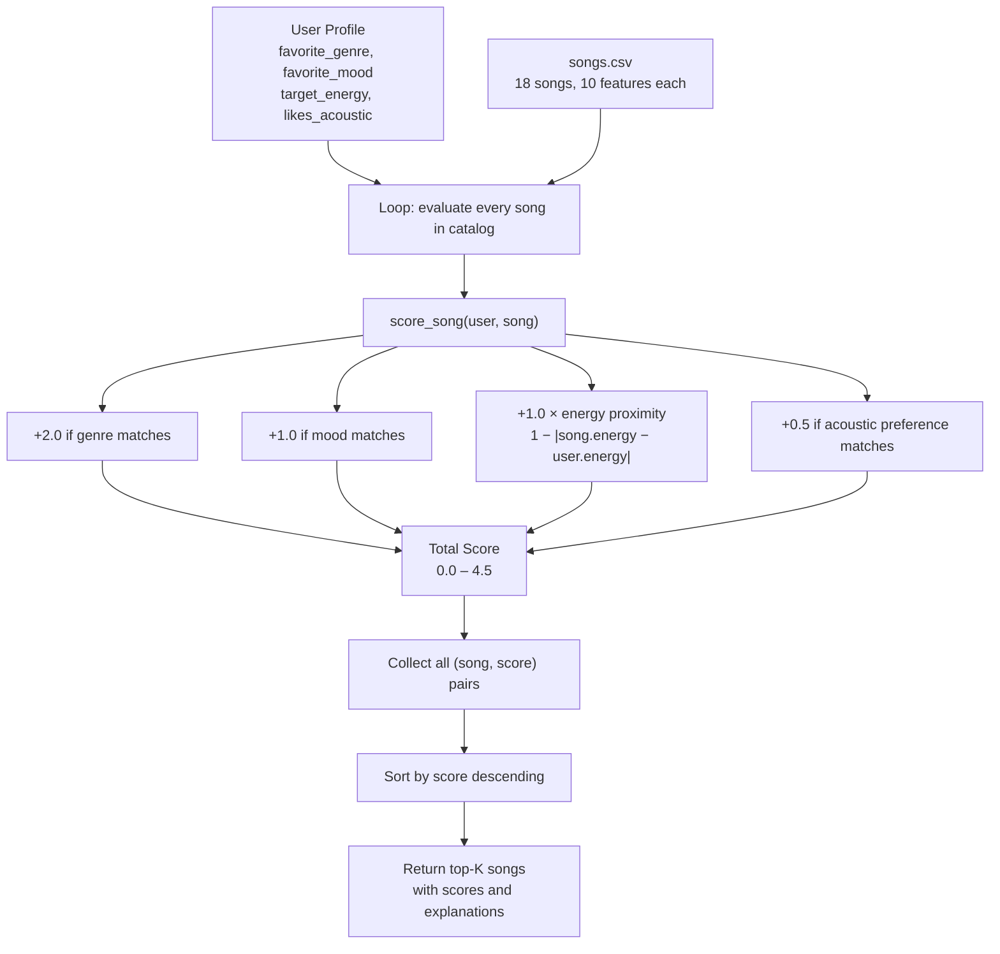

# 🎵 Music Recommender Simulation

## Project Summary

In this project you will build and explain a small music recommender system.

Your goal is to:

- Represent songs and a user "taste profile" as data
- Design a scoring rule that turns that data into recommendations
- Evaluate what your system gets right and wrong
- Reflect on how this mirrors real world AI recommenders

This simulation is a **content-based music recommender**. It represents each song as a bundle of measurable attributes (genre, mood, energy, valence, acousticness) and each user as a taste profile with matching preferences. A scoring function compares a user's profile to every song in the catalog and returns the top-k closest matches — no other users' behavior needed.

---

## How The System Works

### How Real-World Recommenders Work

Platforms like Spotify use two complementary strategies. **Collaborative filtering** finds users whose listening history looks similar to yours and recommends what they loved — it is powerful at scale but struggles with new users who have no history. **Content-based filtering** analyzes the actual properties of songs (tempo, energy, mood, acousticness) and recommends songs whose "audio DNA" matches what you have already enjoyed — it works from day one but can over-narrow results to songs that sound too similar.

In practice, Spotify combines both, layered with human editorial curation for mood playlists. Our simulation focuses on content-based filtering: no cross-user data is needed, just a user taste profile and a catalog of song attributes.

---

### Data: Song Catalog (`data/songs.csv`)

The catalog contains 18 songs across 15 genres and 12 moods:

| Feature | Type | Role in scoring |
|---|---|---|
| `genre` | string | Categorical match — primary taste boundary |
| `mood` | string | Categorical match — emotional context |
| `energy` | float 0–1 | Proximity score — activity level (gym vs study) |
| `valence` | float 0–1 | Positiveness (happy vs melancholic) |
| `acousticness` | float 0–1 | Organic vs electronic production style |
| `tempo_bpm` | float | Pace; correlates with energy |
| `danceability` | float 0–1 | Rhythmic feel |

**Genres represented:** pop, lofi, rock, ambient, jazz, synthwave, indie pop, r&b, country, classical, edm, hip-hop, metal, reggae, folk

**Moods represented:** happy, chill, intense, relaxed, focused, moody, sad, nostalgic, peaceful, euphoric, confident, aggressive

---

### Data: User Profile (`UserProfile`)

A specific taste profile that the recommender compares every song against:

```python
user_prefs = {
    "genre":         "lofi",   # favorite genre
    "mood":          "chill",  # target emotional context
    "energy":        0.40,     # target activity level (0 = calm, 1 = intense)
    "likes_acoustic": True     # prefers organic/acoustic production
}
```

**Can this profile differentiate "intense rock" vs "chill lofi"?** Yes — all four dimensions point in opposite directions:

| Dimension | Intense Rock user | Chill Lofi user |
|---|---|---|
| `genre` | `rock` | `lofi` |
| `mood` | `intense` | `chill` |
| `energy` | ~0.90 | ~0.40 |
| `likes_acoustic` | `False` | `True` |

A song like *Storm Runner* (rock, intense, energy=0.91) scores near maximum for the rock user and near zero for the lofi user — the profile provides clear separation.

**Known limitation of this profile shape:** `likes_acoustic` is a hard boolean — a user who is "mostly acoustic but open to electronic" cannot express that nuance. All four dimensions are also treated independently; there is no way to say "high energy *only if* it is folk."

---

### Algorithm Recipe

**Step 1 — Score one song** (Scoring Rule):

```
score = 0.0

if song["genre"] == user["genre"]:
    score += 2.0                                    # genre match: strongest signal

if song["mood"] == user["mood"]:
    score += 1.0                                    # mood match: contextual signal

energy_proximity = 1.0 - abs(song["energy"] - user["energy"])
score += energy_proximity * 1.0                     # max +1.0 when energy matches exactly

if user["likes_acoustic"] and song["acousticness"] > 0.7:
    score += 0.5                                    # acoustic style bonus
```

**Why these weights?**
- Genre (2.0) is the coarsest filter — a jazz fan will rarely enjoy metal regardless of mood or tempo
- Mood (1.0) is more flexible — a user in a "chill" mood might accept "relaxed" or "peaceful"
- Energy proximity (max 1.0) rewards closeness, not just high-or-low values; a workout user should not get lofi just because it has high valence
- Acousticness (0.5) is a style preference, not a dealbreaker

**Maximum possible score: 4.5** (genre + mood + perfect energy + acoustic bonus)

**Step 2 — Rank the full catalog** (Ranking Rule):

```
scored = [(song, score_song(user_prefs, song)) for song in all_songs]
ranked = sorted(scored, key=lambda x: x[1], reverse=True)
return ranked[:k]
```

Scoring and ranking are separate functions on purpose: you can change the scoring formula without touching the sort logic.

---

### Data Flow Diagram



---

### Potential Biases

- **Genre over-prioritization:** With a 2.0 weight, genre dominates. A perfect mood+energy match in the wrong genre scores only 2.0, while a correct-genre song with mismatched mood and energy can still score 2.5. Niche genres (classical, reggae) may never surface for mainstream users.
- **Catalog coverage gap:** With 18 songs, some genre/mood combinations have only one representative, so the recommender effectively has no choice for those profiles.
- **Boolean acoustic preference:** Acoustic taste is reduced to yes/no; users with moderate preferences get the same treatment as those with strong ones.
- **Energy is the only continuous feature scored:** Tempo, valence, and danceability are in the dataset but currently unused, which means two very different-sounding songs can receive identical scores.

---

## Getting Started

### Setup

1. Create a virtual environment (optional but recommended):

   ```bash
   python -m venv .venv
   source .venv/bin/activate      # Mac or Linux
   .venv\Scripts\activate         # Windows

2. Install dependencies

```bash
pip install -r requirements.txt
```

3. Run the app:

```bash
python -m src.main
```

### Running Tests

Run the starter tests with:

```bash
pytest
```

You can add more tests in `tests/test_recommender.py`.

---

## CLI Output — All Profiles

### Standard Profiles

```
Loaded 18 songs from catalog.

===============================================================================================
USER PROFILE
-----------------------------------------------------------------------------------------------
  genre            pop
  mood             happy
  energy           0.8
===============================================================================================

TOP 5 RECOMMENDATIONS

#   Title                      Artist                 Score  Reasons
-----------------------------------------------------------------------------------------------
1   Sunrise City               Neon Echo               3.98  genre match 'pop' (+2.0); mood match 'happy' (+1.0); energy proximity 0.98 (+0.98)
2   Gym Hero                   Max Pulse               2.87  genre match 'pop' (+2.0); energy proximity 0.87 (+0.87)
3   Rooftop Lights             Indigo Parade           1.96  mood match 'happy' (+1.0); energy proximity 0.96 (+0.96)
4   Concrete Jungle Flow       K-Roc                   0.98  energy proximity 0.98 (+0.98)
5   Night Drive Loop           Neon Echo               0.95  energy proximity 0.95 (+0.95)
===============================================================================================
```

The results make sense: `Sunrise City` is the clear winner because it matches genre, mood, *and* energy. `Gym Hero` ranks 2nd on genre alone — it is pop but not happy, showing that genre (2.0) outweighs mood (1.0) as designed.

### Profile 2 — Chill Lofi (acoustic preferred)

```
#   Title                      Artist                 Score  Reasons
----------------------------------------------------------------------------------------------------
1   Library Rain               Paper Lanterns          4.47  genre match 'lofi' (+2.0); mood match 'chill' (+1.0); energy proximity 0.97 (+0.97); acoustic bonus (acousticness=0.86, +0.5)
2   Midnight Coding            LoRoom                  4.46  genre match 'lofi' (+2.0); mood match 'chill' (+1.0); energy proximity 0.96 (+0.96); acoustic bonus (acousticness=0.71, +0.5)
3   Focus Flow                 LoRoom                  3.48  genre match 'lofi' (+2.0); energy proximity 0.98 (+0.98); acoustic bonus (acousticness=0.78, +0.5)
4   Spacewalk Thoughts         Orbit Bloom             2.40  mood match 'chill' (+1.0); energy proximity 0.90 (+0.90); acoustic bonus (acousticness=0.92, +0.5)
5   Coffee Shop Stories        Slow Stereo             1.49  energy proximity 0.99 (+0.99); acoustic bonus (acousticness=0.89, +0.5)
```

### Profile 3 — Deep Intense Rock

```
#   Title                      Artist                 Score  Reasons
----------------------------------------------------------------------------------------------------
1   Storm Runner               Voltline                3.99  genre match 'rock' (+2.0); mood match 'intense' (+1.0); energy proximity 0.99 (+0.99)
2   Gym Hero                   Max Pulse               1.97  mood match 'intense' (+1.0); energy proximity 0.97 (+0.97)
3   Bass Drop Kingdom          Apex Grid               0.94  energy proximity 0.94 (+0.94)
4   Wildfire Riffs             Iron Veil               0.93  energy proximity 0.93 (+0.93)
5   Sunrise City               Neon Echo               0.92  energy proximity 0.92 (+0.92)
```

### Adversarial / Edge-Case Profiles

```
PROFILE: 4 — ADVERSARIAL: High-Energy Sad (conflicting preferences)
genre: r&b  |  mood: sad  |  energy: 0.90

1   Broken Glass Heart         Velour                  3.62  genre match 'r&b' (+2.0); mood match 'sad' (+1.0); energy proximity 0.62 (+0.62)
2   Storm Runner               Voltline                0.99  energy proximity 0.99 (+0.99)
3   Gym Hero                   Max Pulse               0.97  energy proximity 0.97 (+0.97)
4   Bass Drop Kingdom          Apex Grid               0.94  energy proximity 0.94 (+0.94)
5   Wildfire Riffs             Iron Veil               0.93  energy proximity 0.93 (+0.93)
```
**What this reveals:** The only sad song in the catalog (energy 0.52) wins on genre+mood bonus but misses badly on energy. Songs 2–5 are all high-energy songs with no sad or r&b connection. The system is "tricked" by catalog gaps.

```
PROFILE: 5 — ADVERSARIAL: Genre not in catalog (bossa nova / chill)
genre: bossa nova  |  mood: chill  |  energy: 0.40

1   Midnight Coding            LoRoom                  1.98  mood match 'chill' (+1.0); energy proximity 0.98 (+0.98)
2   Library Rain               Paper Lanterns          1.95  mood match 'chill' (+1.0); energy proximity 0.95 (+0.95)
3   Spacewalk Thoughts         Orbit Bloom             1.88  mood match 'chill' (+1.0); energy proximity 0.88 (+0.88)
4   Focus Flow                 LoRoom                  1.00  energy proximity 1.00 (+1.00)
5   Coffee Shop Stories        Slow Stereo             0.97  energy proximity 0.97 (+0.97)
```
**What this reveals:** Genre preference was completely ignored (no bossa nova in catalog) but the system gave no warning. Max score is only 1.98 vs 4.47 for a well-matched profile — the degraded confidence is visible in the numbers but not communicated to the user.

```
PROFILE: 6 — ADVERSARIAL: Perfect-middle everything (jazz / relaxed / 0.5 energy)

1   Coffee Shop Stories        Slow Stereo             3.87  genre match 'jazz' (+2.0); mood match 'relaxed' (+1.0); energy proximity 0.87 (+0.87)
2   Broken Glass Heart         Velour                  0.98  energy proximity 0.98 (+0.98)
3   Harvest Moon Drive         Dusty Strings           0.98  energy proximity 0.98 (+0.98)
4   Island Breeze              Rootical                0.94  energy proximity 0.94 (+0.94)
5   Midnight Coding            LoRoom                  0.92  energy proximity 0.92 (+0.92)
```
**What this reveals:** With only one jazz song in the catalog, Coffee Shop Stories scores 3.87 while #2 scores 0.98 — a nearly 3-point gap from catalog sparsity, not genuine quality.

### Weight-Shift Experiment

Changed: genre bonus 2.0 → 1.0, energy multiplier ×1.0 → ×2.0

Key result for High-Energy Pop:
```
Original:   1. Sunrise City (3.98)  2. Gym Hero (2.87)       3. Rooftop Lights (1.96)
Experiment: 1. Sunrise City (3.96)  2. Rooftop Lights (2.92)  3. Gym Hero (2.74)
```
`Rooftop Lights` (indie pop, **happy**) jumped above `Gym Hero` (pop, **intense**) because stronger energy weighting made the mood-matching-but-wrong-genre song beat the genre-matching-but-wrong-mood song. This arguably felt *more* accurate for a happy-pop user. Conclusion: the original genre=2.0 weight is safer for a tiny catalog but a larger dataset could support a softer genre boundary.

---

## Experiments You Tried

Use this section to document the experiments you ran. For example:

- What happened when you changed the weight on genre from 2.0 to 0.5
- What happened when you added tempo or valence to the score
- How did your system behave for different types of users

---

## Limitations and Risks

Summarize some limitations of your recommender.

Examples:

- It only works on a tiny catalog
- It does not understand lyrics or language
- It might over favor one genre or mood

You will go deeper on this in your model card.

---

## Reflection

Full model card: [**model_card.md**](model_card.md)

### What I learned about how recommenders turn data into predictions

Building VibeFinder showed me that a lot of hidden work goes into “you might also like” recommendations. It is easy to design a scoring formula, but once you test it on real data, even a small set, problems appear. Some genres might be missing, preferences can conflict, and having only one song in a genre can make the system seem more confident than it really is. In the end, a recommender is only as good as the data it has. The rules only organize decisions. If the data is not there, the system cannot create it.

What surprised me most is that just three factors, genre, mood, and energy, were enough to give results that felt accurate for clear user preferences. There was no machine learning involved, just simple math. Adding explanations like “genre match ‘lofi’ (+2.0)” made the results feel more trustworthy, even though the logic was simple. This is likely why real apps feel reliable. They explain recommendations in a way that makes sense to users.

### Where bias or unfairness could show up

One major issue is when limited data looks like confidence. For example, if there is only one jazz song in a small catalog, it might score much higher than everything else. This is not because it is the best match, but because there are no alternatives. In a real system, this could unfairly affect users who like niche genres. They would keep seeing the same few recommendations, while users who like popular genres get more variety.

Another issue is when the system quietly ignores missing preferences. If a user asks for a genre that is not in the catalog, such as bossa nova, the system ignores that request and uses other factors without telling the user. This can create a poor experience, especially for users whose tastes are not well represented, because they will not understand why the recommendations do not match what they asked for.

---

## 7. `model_card_template.md`

Combines reflection and model card framing from the Module 3 guidance. :contentReference[oaicite:2]{index=2}  

```markdown
# 🎧 Model Card - Music Recommender Simulation

## 1. Model Name

Give your recommender a name, for example:

> VibeFinder 1.0

---

## 2. Intended Use

- What is this system trying to do
- Who is it for

Example:

> This model suggests 3 to 5 songs from a small catalog based on a user's preferred genre, mood, and energy level. It is for classroom exploration only, not for real users.

---

## 3. How It Works (Short Explanation)

Describe your scoring logic in plain language.

- What features of each song does it consider
- What information about the user does it use
- How does it turn those into a number

Try to avoid code in this section, treat it like an explanation to a non programmer.

---

## 4. Data

Describe your dataset.

- How many songs are in `data/songs.csv`
- Did you add or remove any songs
- What kinds of genres or moods are represented
- Whose taste does this data mostly reflect

---

## 5. Strengths

Where does your recommender work well

You can think about:
- Situations where the top results "felt right"
- Particular user profiles it served well
- Simplicity or transparency benefits

---

## 6. Limitations and Bias

Where does your recommender struggle

Some prompts:
- Does it ignore some genres or moods
- Does it treat all users as if they have the same taste shape
- Is it biased toward high energy or one genre by default
- How could this be unfair if used in a real product

---

## 7. Evaluation

How did you check your system

Examples:
- You tried multiple user profiles and wrote down whether the results matched your expectations
- You compared your simulation to what a real app like Spotify or YouTube tends to recommend
- You wrote tests for your scoring logic

You do not need a numeric metric, but if you used one, explain what it measures.

---

## 8. Future Work

If you had more time, how would you improve this recommender

Examples:

- Add support for multiple users and "group vibe" recommendations
- Balance diversity of songs instead of always picking the closest match
- Use more features, like tempo ranges or lyric themes

---

## 9. Personal Reflection

A few sentences about what you learned:

- What surprised you about how your system behaved
- How did building this change how you think about real music recommenders
- Where do you think human judgment still matters, even if the model seems "smart"

