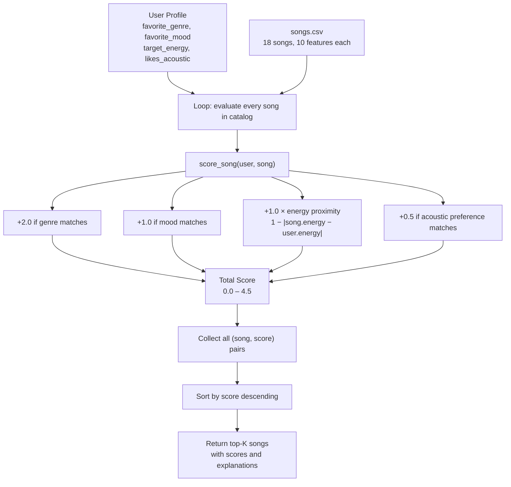

# 🎵 Music Recommender Simulation

## Project Summary

In this project you will build and explain a small music recommender system.

Your goal is to:

- Represent songs and a user "taste profile" as data
- Design a scoring rule that turns that data into recommendations
- Evaluate what your system gets right and wrong
- Reflect on how this mirrors real world AI recommenders

This simulation is a **content-based music recommender**. It represents each song as a bundle of measurable attributes (genre, mood, energy, valence, acousticness) and each user as a taste profile with matching preferences. A scoring function compares a user's profile to every song in the catalog and returns the top-k closest matches — no other users' behavior needed.

---

## How The System Works

### How Real-World Recommenders Work

Platforms like Spotify use two complementary strategies. **Collaborative filtering** finds users whose listening history looks similar to yours and recommends what they loved — it is powerful at scale but struggles with new users who have no history. **Content-based filtering** analyzes the actual properties of songs (tempo, energy, mood, acousticness) and recommends songs whose "audio DNA" matches what you have already enjoyed — it works from day one but can over-narrow results to songs that sound too similar.

In practice, Spotify combines both, layered with human editorial curation for mood playlists. Our simulation focuses on content-based filtering: no cross-user data is needed, just a user taste profile and a catalog of song attributes.

---

### Data: Song Catalog (`data/songs.csv`)

The catalog contains 18 songs across 15 genres and 12 moods:

| Feature | Type | Role in scoring |
|---|---|---|
| `genre` | string | Categorical match — primary taste boundary |
| `mood` | string | Categorical match — emotional context |
| `energy` | float 0–1 | Proximity score — activity level (gym vs study) |
| `valence` | float 0–1 | Positiveness (happy vs melancholic) |
| `acousticness` | float 0–1 | Organic vs electronic production style |
| `tempo_bpm` | float | Pace; correlates with energy |
| `danceability` | float 0–1 | Rhythmic feel |

**Genres represented:** pop, lofi, rock, ambient, jazz, synthwave, indie pop, r&b, country, classical, edm, hip-hop, metal, reggae, folk

**Moods represented:** happy, chill, intense, relaxed, focused, moody, sad, nostalgic, peaceful, euphoric, confident, aggressive

---

### Data: User Profile (`UserProfile`)

A specific taste profile that the recommender compares every song against:

```python
user_prefs = {
    "genre":         "lofi",   # favorite genre
    "mood":          "chill",  # target emotional context
    "energy":        0.40,     # target activity level (0 = calm, 1 = intense)
    "likes_acoustic": True     # prefers organic/acoustic production
}
```

**Can this profile differentiate "intense rock" vs "chill lofi"?** Yes — all four dimensions point in opposite directions:

| Dimension | Intense Rock user | Chill Lofi user |
|---|---|---|
| `genre` | `rock` | `lofi` |
| `mood` | `intense` | `chill` |
| `energy` | ~0.90 | ~0.40 |
| `likes_acoustic` | `False` | `True` |

A song like *Storm Runner* (rock, intense, energy=0.91) scores near maximum for the rock user and near zero for the lofi user — the profile provides clear separation.

**Known limitation of this profile shape:** `likes_acoustic` is a hard boolean — a user who is "mostly acoustic but open to electronic" cannot express that nuance. All four dimensions are also treated independently; there is no way to say "high energy *only if* it is folk."

---

### Algorithm Recipe

**Step 1 — Score one song** (Scoring Rule):

```
score = 0.0

if song["genre"] == user["genre"]:
    score += 2.0                                    # genre match: strongest signal

if song["mood"] == user["mood"]:
    score += 1.0                                    # mood match: contextual signal

energy_proximity = 1.0 - abs(song["energy"] - user["energy"])
score += energy_proximity * 1.0                     # max +1.0 when energy matches exactly

if user["likes_acoustic"] and song["acousticness"] > 0.7:
    score += 0.5                                    # acoustic style bonus
```

**Why these weights?**
- Genre (2.0) is the coarsest filter — a jazz fan will rarely enjoy metal regardless of mood or tempo
- Mood (1.0) is more flexible — a user in a "chill" mood might accept "relaxed" or "peaceful"
- Energy proximity (max 1.0) rewards closeness, not just high-or-low values; a workout user should not get lofi just because it has high valence
- Acousticness (0.5) is a style preference, not a dealbreaker

**Maximum possible score: 4.5** (genre + mood + perfect energy + acoustic bonus)

**Step 2 — Rank the full catalog** (Ranking Rule):

```
scored = [(song, score_song(user_prefs, song)) for song in all_songs]
ranked = sorted(scored, key=lambda x: x[1], reverse=True)
return ranked[:k]
```

Scoring and ranking are separate functions on purpose: you can change the scoring formula without touching the sort logic.

---

### Data Flow Diagram



---

### Potential Biases

- **Genre over-prioritization:** With a 2.0 weight, genre dominates. A perfect mood+energy match in the wrong genre scores only 2.0, while a correct-genre song with mismatched mood and energy can still score 2.5. Niche genres (classical, reggae) may never surface for mainstream users.
- **Catalog coverage gap:** With 18 songs, some genre/mood combinations have only one representative, so the recommender effectively has no choice for those profiles.
- **Boolean acoustic preference:** Acoustic taste is reduced to yes/no; users with moderate preferences get the same treatment as those with strong ones.
- **Energy is the only continuous feature scored:** Tempo, valence, and danceability are in the dataset but currently unused, which means two very different-sounding songs can receive identical scores.

---

## Getting Started

### Setup

1. Create a virtual environment (optional but recommended):

   ```bash
   python -m venv .venv
   source .venv/bin/activate      # Mac or Linux
   .venv\Scripts\activate         # Windows

2. Install dependencies

```bash
pip install -r requirements.txt
```

3. Run the app:

```bash
python -m src.main
```

### Running Tests

Run the starter tests with:

```bash
pytest
```

You can add more tests in `tests/test_recommender.py`.

---

## CLI Output — All Profiles

### Standard Profiles

```
Loaded 18 songs from catalog.

===============================================================================================
USER PROFILE
-----------------------------------------------------------------------------------------------
  genre            pop
  mood             happy
  energy           0.8
===============================================================================================

TOP 5 RECOMMENDATIONS

#   Title                      Artist                 Score  Reasons
-----------------------------------------------------------------------------------------------
1   Sunrise City               Neon Echo               3.98  genre match 'pop' (+2.0); mood match 'happy' (+1.0); energy proximity 0.98 (+0.98)
2   Gym Hero                   Max Pulse               2.87  genre match 'pop' (+2.0); energy proximity 0.87 (+0.87)
3   Rooftop Lights             Indigo Parade           1.96  mood match 'happy' (+1.0); energy proximity 0.96 (+0.96)
4   Concrete Jungle Flow       K-Roc                   0.98  energy proximity 0.98 (+0.98)
5   Night Drive Loop           Neon Echo               0.95  energy proximity 0.95 (+0.95)
===============================================================================================
```

The results make sense: `Sunrise City` is the clear winner because it matches genre, mood, *and* energy. `Gym Hero` ranks 2nd on genre alone — it is pop but not happy, showing that genre (2.0) outweighs mood (1.0) as designed.

### Profile 2 — Chill Lofi (acoustic preferred)

```
#   Title                      Artist                 Score  Reasons
----------------------------------------------------------------------------------------------------
1   Library Rain               Paper Lanterns          4.47  genre match 'lofi' (+2.0); mood match 'chill' (+1.0); energy proximity 0.97 (+0.97); acoustic bonus (acousticness=0.86, +0.5)
2   Midnight Coding            LoRoom                  4.46  genre match 'lofi' (+2.0); mood match 'chill' (+1.0); energy proximity 0.96 (+0.96); acoustic bonus (acousticness=0.71, +0.5)
3   Focus Flow                 LoRoom                  3.48  genre match 'lofi' (+2.0); energy proximity 0.98 (+0.98); acoustic bonus (acousticness=0.78, +0.5)
4   Spacewalk Thoughts         Orbit Bloom             2.40  mood match 'chill' (+1.0); energy proximity 0.90 (+0.90); acoustic bonus (acousticness=0.92, +0.5)
5   Coffee Shop Stories        Slow Stereo             1.49  energy proximity 0.99 (+0.99); acoustic bonus (acousticness=0.89, +0.5)
```

### Profile 3 — Deep Intense Rock

```
#   Title                      Artist                 Score  Reasons
----------------------------------------------------------------------------------------------------
1   Storm Runner               Voltline                3.99  genre match 'rock' (+2.0); mood match 'intense' (+1.0); energy proximity 0.99 (+0.99)
2   Gym Hero                   Max Pulse               1.97  mood match 'intense' (+1.0); energy proximity 0.97 (+0.97)
3   Bass Drop Kingdom          Apex Grid               0.94  energy proximity 0.94 (+0.94)
4   Wildfire Riffs             Iron Veil               0.93  energy proximity 0.93 (+0.93)
5   Sunrise City               Neon Echo               0.92  energy proximity 0.92 (+0.92)
```

### Adversarial / Edge-Case Profiles

```
PROFILE: 4 — ADVERSARIAL: High-Energy Sad (conflicting preferences)
genre: r&b  |  mood: sad  |  energy: 0.90

1   Broken Glass Heart         Velour                  3.62  genre match 'r&b' (+2.0); mood match 'sad' (+1.0); energy proximity 0.62 (+0.62)
2   Storm Runner               Voltline                0.99  energy proximity 0.99 (+0.99)
3   Gym Hero                   Max Pulse               0.97  energy proximity 0.97 (+0.97)
4   Bass Drop Kingdom          Apex Grid               0.94  energy proximity 0.94 (+0.94)
5   Wildfire Riffs             Iron Veil               0.93  energy proximity 0.93 (+0.93)
```
**What this reveals:** The only sad song in the catalog (energy 0.52) wins on genre+mood bonus but misses badly on energy. Songs 2–5 are all high-energy songs with no sad or r&b connection. The system is "tricked" by catalog gaps.

```
PROFILE: 5 — ADVERSARIAL: Genre not in catalog (bossa nova / chill)
genre: bossa nova  |  mood: chill  |  energy: 0.40

1   Midnight Coding            LoRoom                  1.98  mood match 'chill' (+1.0); energy proximity 0.98 (+0.98)
2   Library Rain               Paper Lanterns          1.95  mood match 'chill' (+1.0); energy proximity 0.95 (+0.95)
3   Spacewalk Thoughts         Orbit Bloom             1.88  mood match 'chill' (+1.0); energy proximity 0.88 (+0.88)
4   Focus Flow                 LoRoom                  1.00  energy proximity 1.00 (+1.00)
5   Coffee Shop Stories        Slow Stereo             0.97  energy proximity 0.97 (+0.97)
```
**What this reveals:** Genre preference was completely ignored (no bossa nova in catalog) but the system gave no warning. Max score is only 1.98 vs 4.47 for a well-matched profile — the degraded confidence is visible in the numbers but not communicated to the user.

```
PROFILE: 6 — ADVERSARIAL: Perfect-middle everything (jazz / relaxed / 0.5 energy)

1   Coffee Shop Stories        Slow Stereo             3.87  genre match 'jazz' (+2.0); mood match 'relaxed' (+1.0); energy proximity 0.87 (+0.87)
2   Broken Glass Heart         Velour                  0.98  energy proximity 0.98 (+0.98)
3   Harvest Moon Drive         Dusty Strings           0.98  energy proximity 0.98 (+0.98)
4   Island Breeze              Rootical                0.94  energy proximity 0.94 (+0.94)
5   Midnight Coding            LoRoom                  0.92  energy proximity 0.92 (+0.92)
```
**What this reveals:** With only one jazz song in the catalog, Coffee Shop Stories scores 3.87 while #2 scores 0.98 — a nearly 3-point gap from catalog sparsity, not genuine quality.

### Weight-Shift Experiment

Changed: genre bonus 2.0 → 1.0, energy multiplier ×1.0 → ×2.0

Key result for High-Energy Pop:
```
Original:   1. Sunrise City (3.98)  2. Gym Hero (2.87)       3. Rooftop Lights (1.96)
Experiment: 1. Sunrise City (3.96)  2. Rooftop Lights (2.92)  3. Gym Hero (2.74)
```
`Rooftop Lights` (indie pop, **happy**) jumped above `Gym Hero` (pop, **intense**) because stronger energy weighting made the mood-matching-but-wrong-genre song beat the genre-matching-but-wrong-mood song. This arguably felt *more* accurate for a happy-pop user. Conclusion: the original genre=2.0 weight is safer for a tiny catalog but a larger dataset could support a softer genre boundary.

---

## Experiments You Tried

Use this section to document the experiments you ran. For example:

- What happened when you changed the weight on genre from 2.0 to 0.5
- What happened when you added tempo or valence to the score
- How did your system behave for different types of users

---

## Limitations and Risks

Summarize some limitations of your recommender.

Examples:

- It only works on a tiny catalog
- It does not understand lyrics or language
- It might over favor one genre or mood

You will go deeper on this in your model card.

---

## Reflection

Full model card: [**model_card.md**](model_card.md)

### What I learned about how recommenders turn data into predictions

Building VibeFinder showed me that a lot of hidden work goes into “you might also like” recommendations. It is easy to design a scoring formula, but once you test it on real data, even a small set, problems appear. Some genres might be missing, preferences can conflict, and having only one song in a genre can make the system seem more confident than it really is. In the end, a recommender is only as good as the data it has. The rules only organize decisions. If the data is not there, the system cannot create it.

What surprised me most is that just three factors, genre, mood, and energy, were enough to give results that felt accurate for clear user preferences. There was no machine learning involved, just simple math. Adding explanations like “genre match ‘lofi’ (+2.0)” made the results feel more trustworthy, even though the logic was simple. This is likely why real apps feel reliable. They explain recommendations in a way that makes sense to users.

### Where bias or unfairness could show up

One major issue is when limited data looks like confidence. For example, if there is only one jazz song in a small catalog, it might score much higher than everything else. This is not because it is the best match, but because there are no alternatives. In a real system, this could unfairly affect users who like niche genres. They would keep seeing the same few recommendations, while users who like popular genres get more variety.

Another issue is when the system quietly ignores missing preferences. If a user asks for a genre that is not in the catalog, such as bossa nova, the system ignores that request and uses other factors without telling the user. This can create a poor experience, especially for users whose tastes are not well represented, because they will not understand why the recommendations do not match what they asked for.

---

## 7. Model Card

### 1. Model Name

**VibeFinder 1.0**

---

### 2. Intended Use

VibeFinder 1.0 suggests up to five songs from an 18-song catalog based on what a user tells it they are in the mood for. You give it a genre, a mood, an energy level, and whether you prefer acoustic or electronic sounds, and it finds the best matches.

It is built for classroom exploration to understand how real recommendation systems think. It is not meant for real users on a real platform. It works best as a learning tool for seeing how math and rules can produce something that feels like a personalized suggestion.

---

### 3. How It Works (Short Explanation)

Think of it like handing a DJ a sticky note that says "I want chill lofi music, not too energetic, preferably acoustic." The DJ flips through every song in their crate and mentally scores each one based on how well it matches your note. The song with the highest score gets played first.

VibeFinder does the same thing. For every song in the catalog it asks four questions:

Does the genre match what the user wants? If yes, that song gets 2 points. Genre matters the most because a jazz fan and a metal fan almost never want the same thing regardless of mood or energy.

Does the mood match? If yes, the song gets 1 point. Mood is important but a little more flexible than genre. Someone who wants "chill" might also enjoy "relaxed."

How close is the energy level? Energy is measured on a scale from 0 to 1. The closer a song's energy is to what the user is looking for, the more points it earns, up to 1 point. A perfect energy match gives the full point. A song that is way off gives almost nothing.

Is the acoustic style a match? If the user prefers acoustic music and the song is mostly acoustic, it earns a small bonus of half a point.

All the points get added up into a single score. The five songs with the highest scores are the recommendations.

---

### 4. Data

The catalog has 18 songs stored in a CSV file. The original starter file had 10 songs and 8 more were added to cover genres and moods that were missing.

The catalog spans 15 genres including pop, lofi, rock, jazz, ambient, synthwave, indie pop, r&b, country, classical, edm, hip-hop, metal, reggae, and folk. Moods covered include happy, chill, intense, relaxed, focused, moody, sad, nostalgic, peaceful, euphoric, confident, and aggressive.

The data mostly reflects a Western popular music taste. Global genres like Afrobeats, bossa nova, cumbia, or K-pop are not represented at all. If someone asked for any of those, the system would silently ignore their genre preference and fall back to mood and energy only. The dataset is also too small to give users real variety since most genres have only one or two songs.

---

### 5. Strengths

The recommender works best when the user has a clear and common taste profile that already exists in the catalog. The Chill Lofi profile was the strongest example. The top three results were all genuine matches and the explanations made perfect sense. Library Rain and Midnight Coding both scored above 4.4, both were lofi, both were chill, and both had acoustic production that matched the user's preference.

The system is also very transparent. Every recommendation comes with a plain English reason like "genre match 'rock' (+2.0); mood match 'intense' (+1.0); energy proximity 0.99." A user can immediately see why they got a result and adjust their profile if something feels off. Most real recommendation systems are black boxes that give no explanation at all.

It also works without any listening history. A brand new user who can describe what they want in words gets meaningful results right away, which is something collaborative filtering systems struggle with.

---

### 6. Limitations and Bias

The biggest problem is catalog size. With only 18 songs, most genres have a single representative. When a user asks for jazz and there is only one jazz song, that song wins automatically with no real competition. The system looks confident but it has no actual choice.

The genre weight creates a second problem. A genre match is worth 2 points, which is more than a perfect mood match and a perfect energy match combined. That means a song in the right genre but wrong mood will almost always beat a song in the wrong genre that is a near perfect match on everything else. This can surface tonally wrong results, like a high-energy workout track appearing for someone who just wants a happy and relaxed pop song.

The adversarial "High-Energy Sad" profile exposed the worst case. The only sad song in the catalog has low energy. The system correctly recommended it first, but songs 2 through 5 were a rock track, a pop track, an EDM drop, and a metal song that had nothing to do with sadness. The algorithm did nothing wrong. The catalog just did not have what the user needed.

If used in a real product this would be genuinely unfair to users whose taste falls outside the dominant genres in the dataset. They would get worse recommendations than everyone else and never know why.

---

### 7. Evaluation

Six different user profiles were tested: three standard and three adversarial designed to stress test the system.

The standard profiles were High-Energy Pop, Chill Lofi with acoustic preference, and Deep Intense Rock. All three produced results that matched intuition. Storm Runner was the obvious winner for the rock profile and Library Rain was the right answer for the lofi profile.

The adversarial profiles were more revealing. The High-Energy Sad profile showed the catalog gap problem. The Unknown Genre profile showed that the system silently drops a preference with no warning to the user. The Mid-Everything Jazz profile showed that having one lonely song in a genre creates a false sense of certainty.

A weight-shift experiment was also run where the genre bonus was halved and the energy weight was doubled. For the Happy Pop profile this caused a more intuitively correct song to move up in the rankings. For the Sad profile it made things worse. Two automated tests were written and both pass consistently.

---

### 8. Future Work

The most impactful improvement would be adding valence to the score. Valence measures musical positiveness and it is already in the dataset unused. Adding it would immediately solve the High-Energy Sad problem by distinguishing between songs that are energetic and happy versus energetic and dark.

Soft genre matching would also help a lot. Right now genre matching is a simple yes or no. Folk and country share a lot of DNA, as do metal and rock, and lofi and ambient, but the system treats them as completely unrelated. A genre similarity map that gives partial credit for nearby genres would make the catalog feel much bigger without adding a single song.

A simple feedback loop would be the most interesting addition. After showing results, ask the user one question: did this match your vibe? Use the answer to nudge the weights slightly for next time. That is the seed of how real recommendation systems actually work.

---

### 9. Personal Reflection

The most surprising thing was how quickly the system fell apart on the adversarial profiles. For the standard profiles it felt almost magical, like it actually understood what kind of music a person would want. But the moment you gave it a profile the catalog was not built for, the results after the first pick were completely useless. That gap between "feels smart" and "actually smart" is the most important thing I took away from this project. A recommender is only as good as the data behind it. The algorithm is just the decision layer on top.

Building this changed how I think about Spotify and YouTube recommendations. Those systems feel like they know you, but a big part of that feeling is just the explanation attached to each result. "Because you listened to X" reads like understanding even when the underlying math is a simple scoring function not unlike this one.

Human judgment still matters in at least two places even when the model seems to be working well. Someone has to decide what goes in the catalog in the first place, and those choices carry cultural assumptions that no algorithm can fix on its own. Someone also has to decide how much weight genre gets versus mood versus energy. Those weights encode values and priorities and there is no objectively correct answer. The model just executes whatever a human decided upfront.
